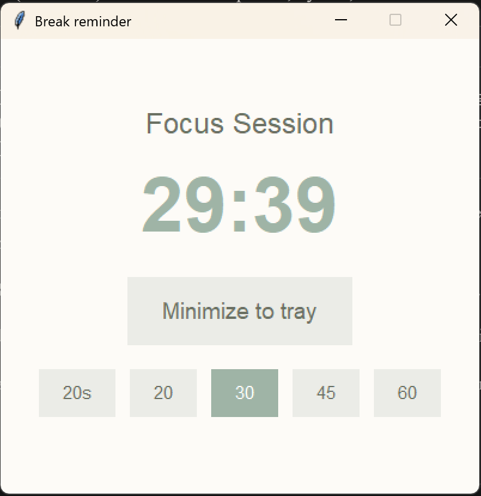

# Take-a-Break Timer


I built a break timer for my wife who forgets to take breaks while working. 

It reminds you to stand up and stretch. 

If you ignore it, it gets hurt feelings. But it will reward you with increasingly funny jokes if you take that break!


**[Install on Windows](https://github.com/talkingtoaj/break-timer/releases/latest):** From the [Releases](https://github.com/talkingtoaj/break-timer/releases/latest) page, download **install_break_reminder.bat** and **double-click it**. The script downloads the app and adds it to startup.

## Features

- Runs on Windows 11+
- Starts automatically with Windows
- Default 30-minute timer (configurable: 20, 30, 45, 60 minutes)
- Gentle chiming if you minimize and don’t come back until after the countdown
- Clean, simple interface

## Releasing

**From WSL (recommended):** Tag and push; GitHub Actions builds the Windows exe and creates the release.

```bash
./release.sh        # prompt for version
./release.sh 1.0.3  # release as v1.0.3
```

**From Windows:** Use **release.bat** to build the exe locally and publish (requires [GitHub CLI](https://cli.github.com/)).

```bat
release.bat
release.bat 1.0.3
```

## Removing the App

1. Open Task Manager > Startup tab
2. Find "BreakTimer" and disable it
3. Delete the break-timer folder